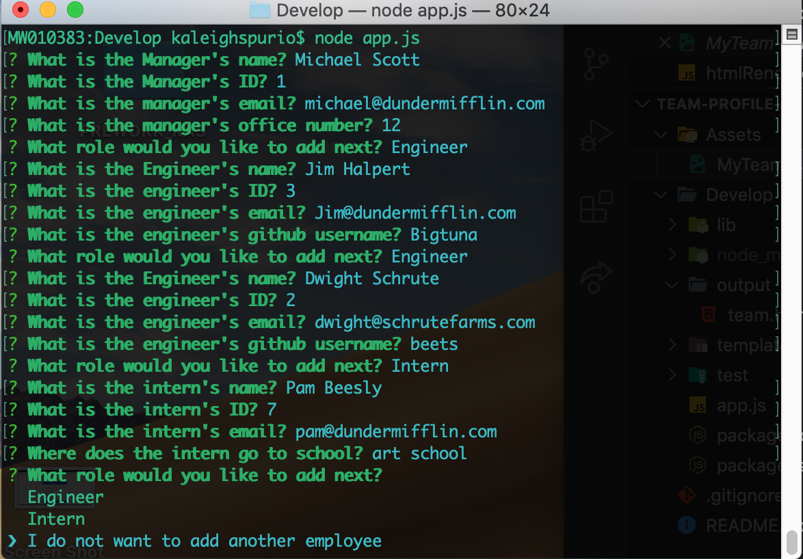
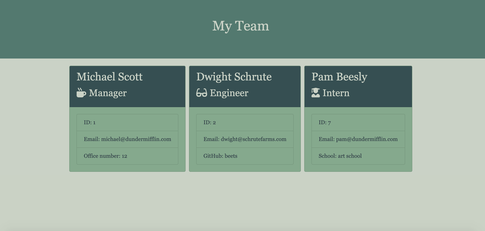

# Team-Profile-Generator

## Description

This is a CLI application that can be used to input employee information and display that information in html.  This application uses node.js, Javascript, HTML, Bootstrap and the inquirer package to prompt the user for some basic employee data (name, id, email, etc.) and then renders it in HTML.

## Install

You will need to run `npm install` to install the npm packages needed.

## Screenshots

Here is a sample of the command line prompts:

Here is how that information is rendered:

Here is a demo:
